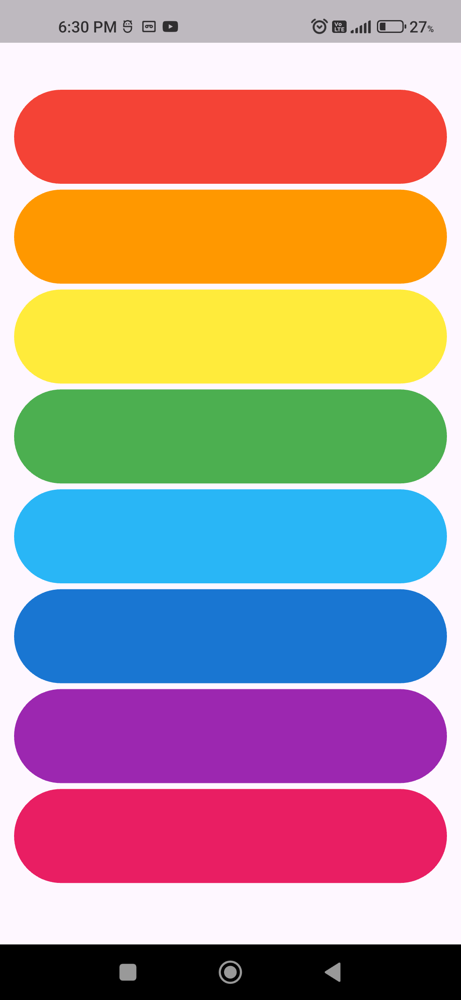

# 🎶 Xylophone App – Flutter
A simple and interactive Xylophone app built using Flutter, where each colorful key plays a different musical sound when tapped.
This project is created to practice audio playback, UI interaction, and asset management in Flutter.

# 🚀 Project Overview

The Xylophone app displays multiple colorful buttons vertically.
Each button represents a musical note and plays a sound using the audioplayers package when tapped.

This is a beginner-friendly Flutter project that focuses on event handling and multimedia integration.

# ✨ Features
🎹 Multiple colorful xylophone keys
🔊 Plays different sounds on tap
⚡ Fast and smooth audio playback
🎨 Clean and minimal UI
📱 Responsive layout

🛠️ Packages Used
audioplayers: ^6.5.0

🧠 Concepts Practiced
Audio playback using audioplayers
Handling audio assets in Flutter
Gesture detection (onTap)
Widget layout and styling
Stateless widgets
Asset management in Flutter

# 📸 Screenshots
